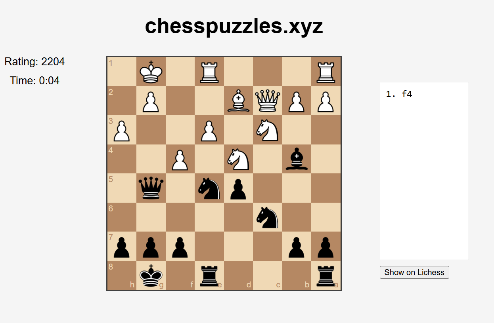
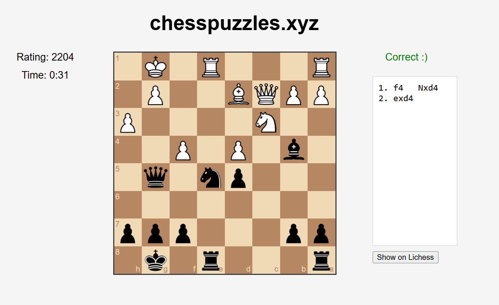
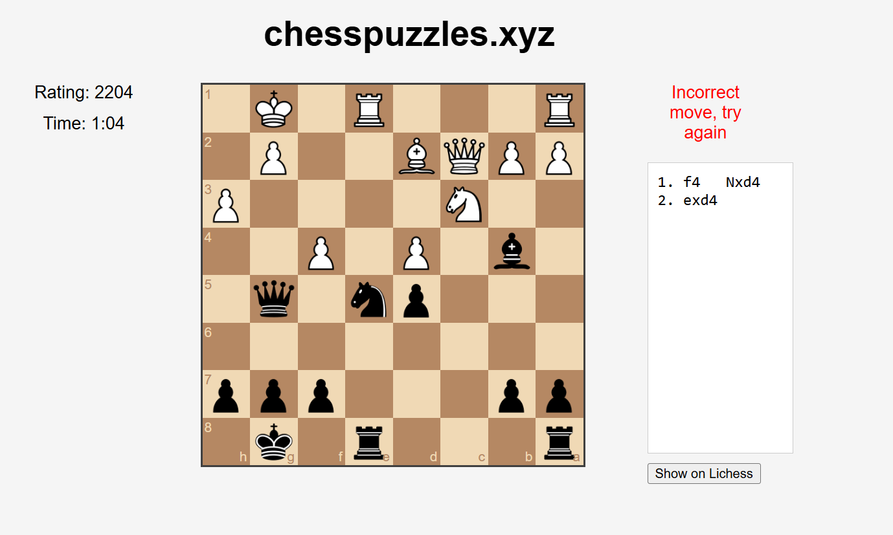
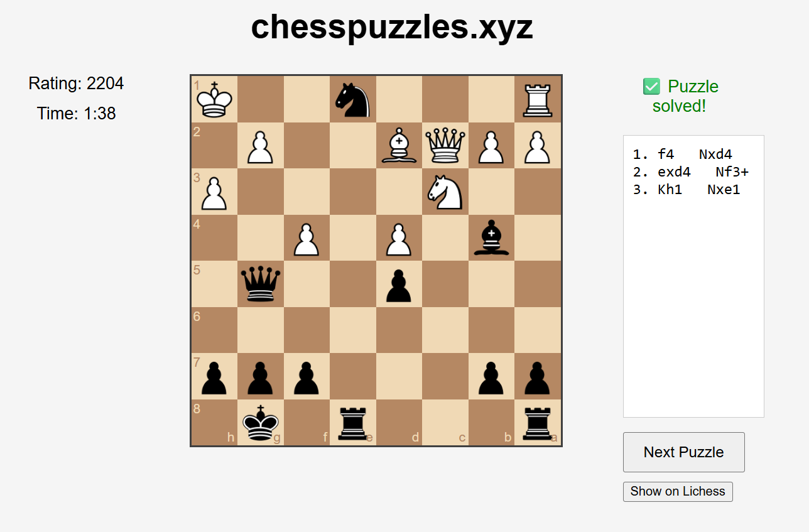

#  chesspuzzles.xyz

**chesspuzzles.xyz** is a chess web app that displays real puzzles from the [Lichess puzzle database](https://database.lichess.org/#puzzles).

## Features

- Puzzles from Lichess with 2000+ rating
- Drag-and-drop piece movement
- Immediate feedback (correct / incorrect)
- Smart board orientation
- Timer + Puzzle Rating
- Move notation display
- "Next" button to load new puzzles
- "Show on Lichess" button to show the puzzle on lichess website.

## Screenshots

> 📌 Make sure your screenshot image is saved as `public/screenshots/PNG_FILE_NAME.png`. You can change the filename and path if needed — just update the path in the markdown.

## How to contribute?

1. Clone the repo
2. Download [Lichess puzzle database](https://database.lichess.org/#puzzles).
3. Place the `lichess_db_puzzle.csv` in the `public/` folder
4. Run `convert.js` to generate your `puzzles.json` (for different puzzles, you may change the `const MIN_RATING = 2000;` value to something else.)
5. Open `index.html` in your browser
6. Contribute the file you want :)

## 🛠 Tech

- HTML / CSS / JavaScript (Vanilla)
- [chess.js](https://github.com/jhlywa/chess.js)
- [chessboardjs](https://github.com/oakmac/chessboardjs)
- Lichess puzzle data
- JSON
## 🎓 License

You can use it for educational purposes.
